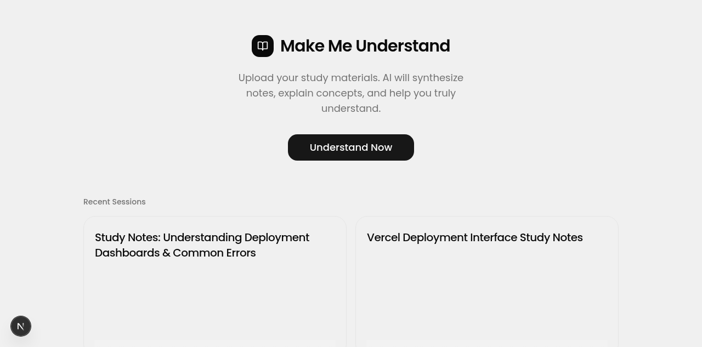
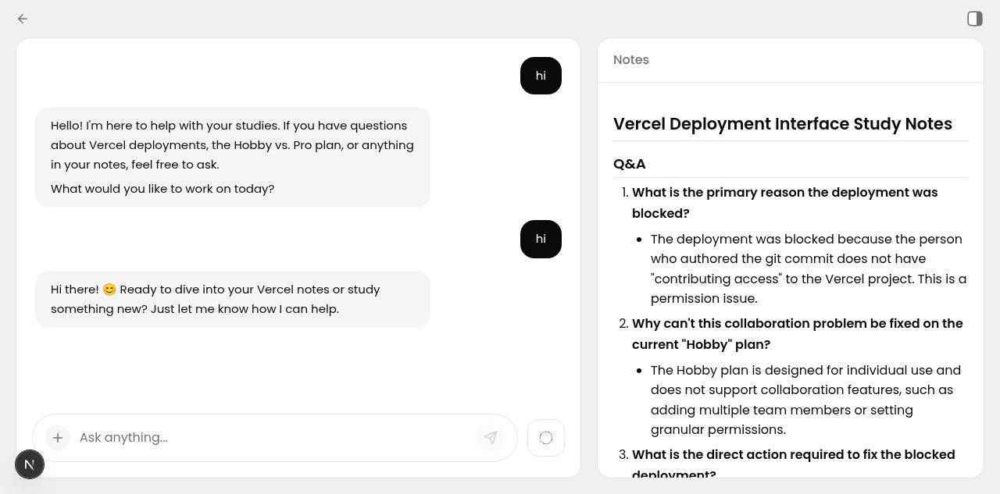
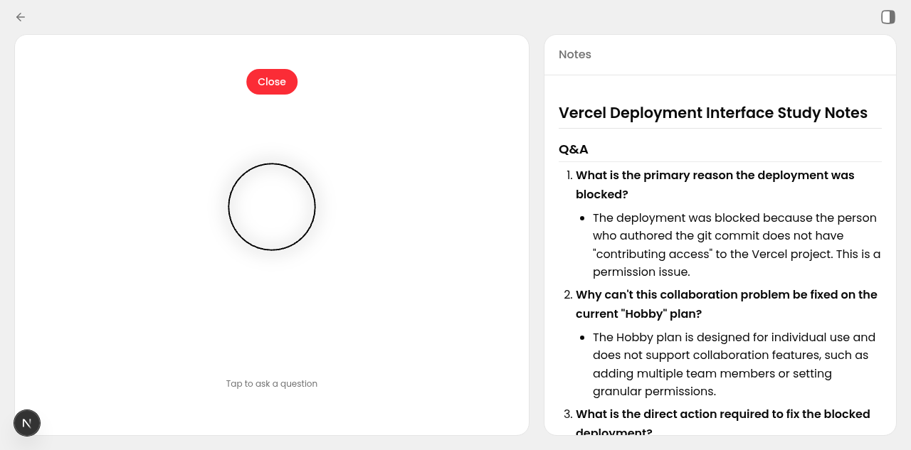

# Make Me Understand

Upload your study materials, and let AI turn them into easy-to-understand notes — then chat with them or listen to voice explanations.

## What it does

1. **Chat** — ask questions about your material and get instant answers
2. **Voice** — tap the Halo button and speak naturally to get spoken explanations
3. **Upload** — snap photos of your notes anytime during a conversation
4. **Study Spaces** — organize sessions into folders
5. **AI Notes** — the AI creates formatted notes when you ask it to

## Features

### AI Tutor
- Structured teaching: Direct Answer → Breakdown → Example → Check-in
- Real-world analogies and step-by-step explanations
- Notes formatted with markdown (headers, bullets, bold)
- Auto-generates session titles after 5 messages

### Voice Mode
- Natural spoken explanations (Kokoro TTS)
- Word-level subtitle sync
- Push-to-talk (hold button or spacebar)
- Voice responses with numbered points and examples

### Study Spaces
- Create folders to organize sessions
- 3D folder with pop-out files on hover
- Right-click/long-press to rename or delete
- Sessions in spaces hidden from dashboard

### Image Support
- Upload images anytime during chat
- AI sees actual images (multimodal, not text extraction)
- Images compressed and stored permanently
- Persistent across all conversations

## Screenshots

### Dashboard


### AI Chat


### Voice Mode


## Tech Stack

- **Frontend** — Next.js, React, TypeScript, Tailwind CSS
- **Backend** — FastAPI, Python, SQLite (aiosqlite)
- **TTS** — Kokoro-82M (Af-Heart voice)
- **Animations** — Framer Motion, Rive
- **AI** — OpenCode Go (MiMo-V2.5)

## Getting Started

### With Docker (recommended)

```bash
git clone https://github.com/VoidLabsRepo/Make-Me-Understand.git
cd Make-Me-Understand

cp .env.example .env
# Edit .env and add your OpenCode API key

docker compose up --build
```

The app will be available at **http://localhost:3000**

### Without Docker

**Backend:**
```bash
cd backend
python3.12 -m venv venv
source venv/bin/activate
pip install -r requirements.txt
uvicorn main:app --reload --host 0.0.0.0 --port 8007
```

**Frontend:**
```bash
cd frontend
npm install
npm run dev -- -p 3007
```

## Environment Variables

| Variable | Description | Required |
|----------|-------------|----------|
| `OPENCODE_API_KEY` | Your OpenCode API key | Yes |

## License

MIT
